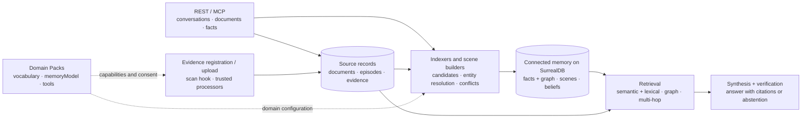

<p align="center">
  <a href="https://brain.inite.ai">
    
  </a>
</p>

<h1 align="center">INITE Brain</h1>

<p align="center">
  <b>Open-source memory for AI agents.</b><br>
  Facts, conversations, events and their evidence — connected across sessions.<br>
  Temporal history, domain memory models and grounded answers over REST and MCP.
</p>

<p align="center">
  <a href="https://github.com/inite-ai/inite-brain-service/actions/workflows/ci.yml"></a>
  <a href="LICENSE"></a>
  <a href="https://github.com/inite-ai/inite-brain-service/stargazers"></a>
  <a href="CONTRIBUTING.md"></a>
  
  
</p>

<p align="center">
  <a href="https://brain.inite.ai">Website</a> ·
  <a href="#architecture">Architecture</a> ·
  <a href="#domain-packs">Domain Packs</a> ·
  <a href="#quick-start">Quick start</a> ·
  <a href="https://brain.inite.ai/en/docs">Docs</a> ·
  <a href="AGENTS.md">Agent guide</a>
</p>

Brain gives an agent memory between conversations: what was said, what changed,
which entities are involved, and what supports an answer. A bitemporal graph
stores structured facts and relationships; source episodes preserve context;
scenes and beliefs capture events and evolving state. **Domain Packs** adapt
that memory to a product's vocabulary and lifecycles without forking the engine.

Run Brain on your infrastructure or connect to the hosted service at
[brain.inite.ai](https://brain.inite.ai). The web app provides memory search and
exploration; REST and MCP provide the integration surface.

## Why Brain

- **Memory with its context.** Retrieve structured facts, source passages and,
  when enabled, scenes and beliefs. Follow provenance back to the supporting
  conversation, document or evidence fragment.
- **Changes stay inspectable.** Facts carry valid time and knowledge time.
  Updates can supersede earlier facts; unresolved disagreements remain
  `COMPETING`. Retraction preserves history; administrative forgetting deletes
  associated records and leaves tombstones.
- **A model of your domain.** Packs define typed predicates, extraction
  guidance, scene schemas, state transitions, verification and retention hints,
  and optional media capabilities and MCP tools.
- **Scope is explicit.** Each tenant has a separate database. Personal memory
  uses `userId`; omitting it selects tenant-global memory. Key scopes, ABAC
  policies and PII controls further constrain access.
- **Answers can be checked.** Hybrid search, graph retrieval and multi-hop
  gather evidence. Synthesis cites it and runs verification; strict guardrails
  can abstain when support is insufficient.

## Architecture

Brain separates source material, derived memory and the read path. This is a
conceptual view; individual ingestion routes and retrieval profiles activate
different parts of it.



| Memory layer | What it preserves |
| --- | --- |
| **Facts and entities** | Typed claims, canonical entities, relationships, confidence, source attribution and temporal history. |
| **Episodes** | Source turns and conversation context that derived memory can point back to or be rebuilt from. |
| **Scenes** | Bounded events with gists, entities, state changes and source links. Optional gist embeddings and a scene retrieval lane make them searchable alongside other evidence. |
| **Beliefs** | Derived state with revision history and supporting scenes. Pack-projected state deltas can feed belief promotion. |
| **Evidence** | Assets, located fragments, processing runs and derived representations, with links to the memories they support. |

**Rebuildable memory.** Derived worlds can be rebuilt from retained episodes in
a staging version. Readers stay pinned to the previous world until promotion.
Scene maintenance can process dirty conversations on a schedule, with budgets,
leases and metrics; it can compose scenes and promote supported beliefs.

**Configurable retrieval.** Retrieval profiles select mechanisms for the corpus
and question. Semantic and lexical search, graph expansion, reranking, raw
passages, scene retrieval and belief retrieval are distinct capabilities. A
known entity can enter through `graph_retrieve`; a question spanning
relationships can use `search_multi_hop`.

**Separate serving and background work.** The NestJS service uses a
SurrealDB-backed job queue, leases and worker-thread offloads. Run the image as
one process or split `PROCESS_ROLE=api|worker`; see the
[operations guide](docs/operations.md#splitting-api-and-worker-roles).

The code includes capabilities that are **opt-in**, not a promise that every
installation runs every layer. Scene construction, scene serving, belief
promotion, evidence upload/processing and pack projections have separate gates.
Check the [architecture](docs/architecture.md), [operations](docs/operations.md)
and flag definitions for [scenes](src/common/scene-flags.ts),
[evidence](src/common/evidence-flags.ts) and
[pack projections](src/common/pack-projection-flags.ts) when enabling them.

## Domain Packs

A pack is a versioned JSON manifest installed per tenant. It tells the engine
how to interpret a domain's material. Pack-derived observations remain
candidates for the core pipeline to validate and resolve.

| A pack can declare | Purpose |
| --- | --- |
| `predicates` | Typed vocabulary, value constraints, conflict semantics, decay and PII classes. |
| `extractionProfile`, `evalFixtures` | Domain instructions, examples and extraction checks. |
| `memoryModel` | Scene schemas, state models and transitions, attention hints, verification rules and advisory retention hints. Also declares supported modalities, requested processor capabilities and raw-evidence policy. |
| `indexer`, `seedDocuments` | Participation in document indexing and knowledge supplied with the pack. |
| `mcpTools` | Additional agent tools, subject to explicit operator consent. |

The [industry pack library](packs) includes:

| Pack | Example memory models |
| --- | --- |
| [`real_estate`](packs/real-estate.pack.json) | Listings, tenancies and permits. |
| [`fintech`](packs/fintech.pack.json) | Licenses and certifications. |
| [`medical`](packs/medical.pack.json) | Drug ontology, prescription and approval lifecycles. |
| [`legal`](packs/legal.pack.json) | Agreements, obligations and legal matters. |
| [`insurance`](packs/insurance.pack.json) | Policy and claim lifecycles. |
| [`hr`](packs/hr.pack.json) | Positions and employee lifecycles. |

For example, `real_estate` declares the listing path
`listed → under_offer → sold`, as well as withdrawal and return-to-market
transitions. It distinguishes viewing and closing scenes, with an ephemeral
retention hint for a viewing and a durable hint for a closing.

The built-in [`code_memory`](src/ai/domain-packs/code-memory.pack.ts) pack covers
engineering decisions, rationale, invariants, gotchas and change lifecycles.
Use `record_decision`, `why` and `recall_decisions` to retain the reasons behind
the code. The six industry packs are distributable; built-in code memory is
part of the core seed.

**Author and distribute.** Scaffold with `pnpm pack:init my_pack`, validate,
optionally sign, publish to a registry and install per tenant. Registry versions
are immutable, installs are checksum-pinned, and signature requirements follow
the server's trust policy. Registry and marketplace support discovery,
publisher profiles, mirroring and optional billing.

**Consent is part of installation.** The current first-party industry packs
declare media capabilities, so installing them requires reviewing that section
and passing `--accept-modalities`. This authorizes the declared capabilities;
it does not supply a missing processor or enable every server feature. Pack
MCP tools have a separate consent path. Built-in `code_memory` media declarations
also do not, by themselves, activate media processing.

Full authoring, signing and installation commands:
[Domain Packs standard](docs/domain-packs.md) ·
[MCP pack tools](docs/mcp-pack-tools.md) ·
[pack evaluation](test/eval/domain-packs/README.md).

## Quick start

### Use the hosted service

Hosted brain is provisioned per company: a tenant (`companyId`) and a
scoped API key. **Key issuance is operator-side today** — self-serve
creation in the web app is not shipped yet, so ask for one at
`mike@inite.ai` or through a GitHub issue. The
[keys screen](https://brain.inite.ai/en/app/keys) shows the connection
recipes for the key you were given. Everything below also runs against a
local instance, which needs nobody's approval.

```bash
export BRAIN_URL="https://brain.inite.ai"
export BRAIN_KEY="brain_YOUR_API_KEY"
```

### Run locally

Prerequisites: **Node.js 22**, **pnpm 10** and **Docker Compose**. The default
model configuration needs an OpenAI API key. Local embeddings and alternative
model providers are configuration choices; see [operations](docs/operations.md).

```bash
git clone https://github.com/inite-ai/inite-brain-service.git
cd inite-brain-service
pnpm install --frozen-lockfile
cp .env.example .env
# Set OPENAI_API_KEY in .env for the default model configuration.
```

Create a local read/write key. This appends a generated key and its registration
to your development `.env`; Brain authenticates against the SHA-256 hash.

```bash
node <<'JS'
const { randomBytes, createHash } = require('node:crypto');
const { appendFileSync } = require('node:fs');
const key = 'brain_' + randomBytes(24).toString('hex');
const keys = [{
  keyHash: 'sha256:' + createHash('sha256').update(key).digest('hex'),
  companyId: 'co_demo',
  scopes: ['brain:read', 'brain:write'],
}];
appendFileSync('.env', '\nBRAIN_KEY=' + key + '\nBRAIN_API_KEYS=' + JSON.stringify(keys) + '\n');
JS

docker compose up -d surrealdb
pnpm start:dev
```

In a second terminal, from the same directory:

```bash
export BRAIN_URL="http://localhost:3000"
export BRAIN_KEY="$(node --env-file=.env -p 'process.env.BRAIN_KEY')"
curl --fail-with-body "$BRAIN_URL/health"
```

For the full container setup, use `docker compose --env-file .env up -d --build`
instead of `pnpm start:dev`. The app service publishes no host port — that is
what lets `--scale brain=N` run several replicas — so copy
`docker-compose.override.yml.example` to `docker-compose.override.yml` first;
it maps host **3030**, and `BRAIN_URL=http://localhost:3030` then works for the
requests below. The Compose defaults are for local development; production
credentials and topology are covered in [deployment](docs/DEPLOY.md).

### Write and retrieve a fact

The same requests work with either `BRAIN_URL` above:

```bash
curl --fail-with-body -X POST "$BRAIN_URL/v1/ingest/fact" \
  -H "Authorization: Bearer $BRAIN_KEY" \
  -H "Content-Type: application/json" \
  -d '{
    "entityRef": { "vertical": "rent", "id": "cust_42" },
    "predicate": "complained_about",
    "object": "late maintenance",
    "validFrom": "2026-09-01T10:00:00Z",
    "userId": "user_42",
    "source": { "vertical": "rent", "messageId": "msg_1" }
  }'

curl --fail-with-body -X POST "$BRAIN_URL/v1/search" \
  -H "Authorization: Bearer $BRAIN_KEY" \
  -H "Content-Type: application/json" \
  -d '{ "query": "maintenance issues", "userId": "user_42", "limit": 5 }'
```

Use your application's stable user ID on **both** writes and reads. Omit
`userId` on both only for tenant-global memory. The local key above has no
administrative scope; pack installation and forgetting require an appropriately
scoped operator key. More: [getting started](docs/getting-started.md).

## Connect an agent

For clients that launch a stdio MCP server, use the first-party
[`@inite/brain-mcp`](clients/brain-mcp/README.md) connector. This configuration
fits clients with a `mcpServers` map, including Claude Desktop:

```json
{
  "mcpServers": {
    "brain": {
      "command": "npx",
      "args": ["-y", "@inite/brain-mcp"],
      "env": {
        "BRAIN_API_KEY": "brain_YOUR_API_KEY",
        "BRAIN_COMPANY_ID": "YOUR_COMPANY_ID"
      }
    }
  }
}
```

For the local setup, use company ID `co_demo`, the key from `.env`, and add
`"BRAIN_BASE_URL": "http://localhost:3000"` to `env` (port `3030` for Compose).
Node.js and `npx` must be available to the client.

Clients with native remote MCP support can connect directly over
**Streamable HTTP**:

```text
URL: https://brain.inite.ai/mcp/<companyId>
Authorization: Bearer brain_<api-key>
```

The key's scopes determine available tools; server flags and installed packs
can extend the surface. The connector forwards tools and resources, and bridges
MCP sampling when the client supports it. See the
[per-client setup guide](https://brain.inite.ai/en/docs/mcp/setup).

| Agent task | Start with |
| --- | --- |
| Find relevant memory | `search_knowledge`, `graph_retrieve`, `search_multi_hop` |
| Answer with citations | `synthesize` |
| Resume after a gap | `memory_diff`, `get_entity_timeline` |
| Record information | `record_fact` for one claim; `ingest_document` for longer material |
| Inspect disagreement | `detect_contradiction`, `get_competing_facts` |
| Remember engineering rationale | `record_decision`, `why`, `recall_decisions` |

Read [AGENTS.md](AGENTS.md) for memory semantics and the
[skills guide](skills/README.md) for reusable agent workflows.
Synthesis keeps fact references in `citations` and other evidence references
(episodes, fragments, scenes and beliefs) in `evidenceCitations`; preserve both
when presenting an answer.

## Feed it documents

Enable `DOCUMENT_INGEST_ENABLED=1` on the server. Submit normalized text through
**Source → Indexer → Candidates → Brain**:

```bash
curl --fail-with-body -X POST "$BRAIN_URL/v1/ingest/document" \
  -H "Authorization: Bearer $BRAIN_KEY" \
  -H "Content-Type: application/json" \
  -d '{
    "kind": "markdown",
    "title": "Acme maintenance review",
    "text": "Customer cust_42 reported late maintenance. The team agreed to review response times next week.",
    "occurredAt": "2026-09-01T10:00:00Z",
    "userId": "user_42",
    "contextRef": { "vertical": "rent" }
  }'
```

Indexers stage candidates before the core resolves and commits facts. Stored
content can be re-indexed after installing a new pack; external indexers can
join over a pull work API. `storeContent: false` disables content retention for
that document, so later re-indexing cannot reuse its text.
[Document pipeline](docs/document-pipeline.md) ·
[External indexers](docs/indexer-protocol.md).

## Files and evidence

The evidence plane supports metadata/reference registration through
`POST /v1/ingest/evidence-asset` and multipart blob upload through
`POST /v1/ingest/evidence-blob`. Uploaded assets pass a scan hook and can be
dispatched to trusted processors; outputs are derived representations, with
fragment locators where supplied by the processor.

Current adapters include local image metadata decoding, PDF text-layer
extraction and plain-text extraction. **Image metadata is not visual scene
understanding; PDF text extraction is not OCR.** A modality declared by a pack
is a capability request, not proof that a corresponding audio, video or vision
processor is installed.

These paths require their evidence gates, storage configuration and applicable
pack consent. Raw serving additionally checks scope and PII policy.
[Evidence contracts](src/contracts/evidence) ·
[Evidence configuration](src/common/evidence-flags.ts) ·
[Processor adapters](src/evidence/processing/adapters).

## Build on Brain

- **Extend the domain:** [author a pack](docs/domain-packs.md), publish to the
  registry and install a reviewed version per tenant.
- **Connect an indexer:** use the [pull protocol](docs/indexer-protocol.md) and
  [reference client](examples/reference-indexer.ts).
- **Extend the agent:** declare [pack MCP tools](docs/mcp-pack-tools.md), with
  separate consent for the added tool surface.
- **Inspect the API:** [OpenAPI 3.1](docs/openapi.json) is generated with
  `pnpm openapi:build` from the platform contracts.

## Quality and evaluation

Retrieval, answer accuracy and state-transition correctness measure different
things. Published scores belong to a particular dataset, reader model,
retrieval profile, token budget and code revision; they are not a general
accuracy guarantee for the running service.

| Evaluation | What it probes |
| --- | --- |
| LoCoMo | Representation quality when the source conversation fits in context. |
| LongMemEval | Recall and reasoning over longer conversation histories. |
| BEAM | How quality changes as history scales. |
| Memory fitness and state transitions | Mechanical, judge-free checks of memory behavior and lifecycle changes. |
| Domain-pack and code-memory batteries | Domain extraction, entity identity, state and engineering-memory scenarios. |

Conversational-memory results use a **strict binary judge, our own full-context
baseline, paired statistics and a held-out split**. Read the
[evaluation protocol](docs/eval-protocol.md) and
[methodology](docs/eval-methodology.md) alongside any reported number; scores
published under different protocols are not directly comparable.

**CI:** PRs run lint, formatting, type checking, builds, unit tests with coverage,
socket and integration tests, plus frontend checks and supply-chain checks.
The real-LLM quality eval runs **nightly or by manual dispatch**, not on every
PR. The workflow is the source of truth:
[`.github/workflows/ci.yml`](.github/workflows/ci.yml).

Battery guides: [memory fitness](test/eval/memory-fitness/README.md) ·
[state transitions](test/eval/state-transitions/README.md) ·
[domain packs](test/eval/domain-packs/README.md) ·
[code memory](test/eval/code-memory/README.md).

## Stack

Node.js 22 · NestJS · TypeScript · SurrealDB 3.x · configurable embedding and
LLM providers · local BGE-M3 option · configurable reranking · SurrealDB-backed
jobs and leases · worker threads · OpenTelemetry. The web app and docs use
Next.js, React and Tailwind CSS.

## Documentation

[Documentation hub](docs/README.md) · [Web docs, EN/RU](https://brain.inite.ai/en/docs)

| Task | Read |
| --- | --- |
| Integrate | [Getting started](docs/getting-started.md), [API](docs/api.md), [MCP agent guide](AGENTS.md) |
| Understand memory | [Architecture](docs/architecture.md), [Data model](docs/data-model.md), [Bitemporal semantics](docs/bitemporal-semantics.md), [Retrieval profiles](docs/architecture-manifest.md) |
| Inspect provenance and access | [Fact provenance](docs/fact-provenance-api.md), [User profiles](docs/user-profile-api.md), [Source trust](docs/source-reputation.md), [ABAC](docs/abac.md) |
| Extend | [Domain Packs](docs/domain-packs.md), [Document pipeline](docs/document-pipeline.md), [MCP pack tools](docs/mcp-pack-tools.md) |
| Operate | [Operations](docs/operations.md), [Operator playbook](docs/operator-playbook.md), [Deployment](docs/DEPLOY.md) |
| Evaluate | [Protocol](docs/eval-protocol.md), [Methodology](docs/eval-methodology.md), [Harness](docs/eval.md) |

## Contributing

See [CONTRIBUTING.md](CONTRIBUTING.md) for the workflow and
[CODE_OF_CONDUCT.md](CODE_OF_CONDUCT.md) for community guidelines.

```bash
pnpm lint:ci
pnpm format:check
pnpm typecheck
pnpm build
pnpm test
pnpm test:socket
# Integration suites require Docker:
pnpm test:e2e
pnpm test:e2e:jobs
```

Choose additional evals for the behavior you change; real-model runs require
provider credentials. Database changes belong in new numbered migrations in
`src/db/migrations/`. For vulnerability reports, follow
[SECURITY.md](SECURITY.md).

## Roadmap

Follow [issues](https://github.com/inite-ai/inite-brain-service/issues) and
[releases](https://github.com/inite-ai/inite-brain-service/releases) for current
work. Design notes and earlier experiments remain in [docs/roadmap](docs/roadmap);
read their dates and status before treating an item as shipped or pending.

## License

[AGPL-3.0-or-later](LICENSE).
