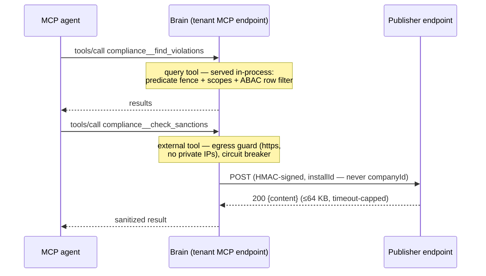

# Pack-declared MCP tools

How a Domain Pack extends a tenant's MCP surface with its own tools —
without running any third-party code inside Brain. A pack's manifest may
ship an `mcpTools` section; once the operator installs the pack **and
explicitly consents to that section**, the declared tools appear in the
tenant's MCP `tools/list` next to the built-in families, named
`<packId>__<toolName>`.

Settled design constraint: **no in-process plugin code**. A pack tool is
one of exactly two shapes:

- **`query`** — a declarative read over the tenant's knowledge graph,
  locked to the pack's own (namespaced) predicates;
- **`external`** — an HTTPS proxy: Brain POSTs the call, HMAC-signed,
  to an endpoint the pack publisher operates.

Each shape is independently toggleable by the operator (see
[Operator flags](#operator-flags)).



## Manifest reference

```jsonc
{
  "id": "compliance",
  "version": "1.2.0",
  "predicates": [ /* compliance__* vocabulary */ ],
  "mcpTools": [                       // max 8 per pack
    {
      "kind": "query",
      "name": "find_violations",      // ^[a-z][a-z0-9_]{1,40}$, no "__"
      "title": "Find compliance violations",       // ≤ 80 chars
      "description": "Search recorded compliance violations.", // ≤ 500
      "query": {
        "surface": "search",          // or "facts_by_predicate"
        "predicates": ["violation"],  // localIds of THIS pack (optional for search)
        "defaultLimit": 10,           // 1..20
        "minConfidence": 0.5          // 0..1, search surface only
      }
    },
    {
      "kind": "external",
      "name": "check_sanctions",
      "description": "Screen a counterparty against the publisher's sanctions data.",
      "endpoint": "https://tools.publisher.example/sanctions",  // https only
      "timeoutMs": 10000,             // 1000..30000, default 10000
      "params": [                     // ≤ 8 declared params
        { "name": "counterparty", "type": "string", "required": true, "maxLength": 200 },
        { "name": "mode", "type": "string", "enum": ["fast", "deep"] }
      ]
    }
  ]
}
```

Validation runs in `pnpm pack:validate`, at publish, at install, and
defensively again before every registration (`validateMcpTools`):
1–8 tools; unique snake_case names without the reserved `__` separator;
description required (≤ 500); query predicates must be the pack's OWN
localIds (`facts_by_predicate` requires them); external endpoints must
parse as http(s) URLs; params are capped at 8 with `string | number |
boolean` types, `enum`/`maxLength` for strings only.

The section lives inside the signed, checksummed manifest — publisher
signatures and version immutability cover it with no extra machinery.

## Install consent (and re-consent)

Installing a pack whose manifest declares `mcpTools` **fails with 400**
unless the request carries the explicit flag:

```
POST /v1/admin/packs
{ "manifest": { … }, "acceptMcpTools": true }
```

The refusal lists every tool's name, kind, and (for external tools) the
endpoint, so the operator reviews exactly what they accept. The same
flag exists on `POST /v1/admin/packs/from-registry`.

Consent is stored with a sha256 checksum of the canonical-JSON
`mcpTools` section:

- an **upgrade that leaves the section unchanged** carries consent over
  (no flag needed);
- an **upgrade that changes it** (any tool added/removed/edited)
  re-requires `acceptMcpTools: true`;
- an upgrade that **drops** the section clears the stored consent.

The MCP reader only ever registers tools whose stored consent checksum
matches the stored section — a row edited out-of-band serves nothing.

## Modality consent (media/biometric tier)

The same consent shape covers a pack's **non-text modality declaration**
(image/audio/video processing and any raw-evidence serving capability,
migration 0112). Installing a pack that declares non-text modalities
fails with 400 unless the request carries `acceptModalities: true` —
on both install routes, exactly like `acceptMcpTools`.

ONE checksum (canonical-JSON sha256) covers the whole media section:
the declared non-text modalities **plus** any raw-evidence capability
declaration. Any change to either is a single re-consent trigger; an
upgrade that leaves the section byte-identical carries consent over; an
upgrade that drops it clears the stored consent. No manifest declares
modalities today, so the gate is inert by construction for every
existing pack.

Two further gates stack on top of consent (deny-overrides — every layer
must pass):

- **Raw-evidence per-call gate** (`src/mcp/raw-evidence-gate.ts`): a
  future pack tool that serves raw media evidence must call
  `gateRawEvidence` per served fragment — pack declares the capability,
  stored consent checksum is current, and the fragment passes the media
  PII gate.
- **Media PII gate** (`src/common/media-pii.ts`): media rows carry
  `piiClasses` with INVERTED polarity vs the text `piiClass` fence —
  absence (unclassified) is **blocked**, only the affirmatively-clean
  empty array is open, and non-empty classes require the env-key-only
  `brain:read_media` scope (deliberately stricter than, and never
  conflated with, `brain:read_pii`; never mintable via jwks).

## Query tools

Query tools are served entirely by Brain. The input schemas are fixed
server-side (a pack chooses names and descriptions, never the query
shape), and the predicate set is **server-computed from the pack's own
manifest** — a pack cannot point a tool at core predicates or another
pack's namespace.

| surface | input | behaviour |
|---|---|---|
| `search` | `{query (≤500 chars), limit? (1..20)}` | The standard hybrid search pipeline, restricted to the spec's `predicates` (localIds → `<packId>__<localId>`) or ALL of the pack's predicates when unset; `minConfidence` from the spec; limit = `min(limit ?? defaultLimit ?? 10, 20)`. |
| `facts_by_predicate` | `{predicate (enum of declared localIds), entity? (id), limit? (1..50)}` | Active-believed-now facts for ONE namespaced predicate, optionally scoped to an entity; ordered newest-first. |

Both surfaces run under the caller's scopes and the full row fence:
the predicate `requiresScope` gate (a `brain:read` key never sees
`brain:read_pii`-fenced pack facts) plus the ABAC row filter
(surface `pack_facts_by_predicate`; the search surface inherits
SearchService's own row fence).

**ABAC kind**: query tools are `read`-kind — they register under a
readonly-allow policy (`@readonly` macro) and can be denied by their
concrete namespaced name.

## External tools

An external tool call becomes a single signed POST to the declared
endpoint (no retries — the calling agent should see the failure):

```
POST <endpoint>
Content-Type: application/json
X-Brain-Event: mcp_tool_call
X-Brain-Signature: sha256=<hex HMAC-SHA256 over the raw request body>

{
  "event": "mcp_tool_call",
  "tool": "check_sanctions",          // local name (unprefixed)
  "packId": "compliance",
  "installId": "3f2a…-…",             // opaque per-install identity
  "requestId": "b41c…-…",             // unique per call
  "ts": "2026-07-16T10:00:00.000Z",
  "args": { "counterparty": "Acme GmbH" }
}
```

**The wire never carries companyId.** `installId` (migration 0068) is
minted at install time and stays stable across upgrades — the publisher
keys its per-tenant state on it without learning Brain's tenant ids.

The HMAC key is the pack's **install webhook secret** — the same secret
external indexers use, returned ONCE in the install response
(`webhookSecret`). Verify before trusting a request:

```ts
import { createHmac, timingSafeEqual } from 'node:crypto';

function verify(rawBody: Buffer, header: string, secret: string): boolean {
  const expected = `sha256=${createHmac('sha256', secret).update(rawBody).digest('hex')}`;
  return (
    header.length === expected.length &&
    timingSafeEqual(Buffer.from(header), Buffer.from(expected))
  );
}
```

Respond `200` with JSON:

```jsonc
{ "content": "Acme GmbH: no sanctions hits" }        // string → text result
{ "content": { "verdict": "clean", "score": 0.98 } } // object → text + structuredContent
{ "error": "counterparty not found" }                // application-level error
```

Rules Brain enforces on the response path:

- timeout `timeoutMs` (default 10 s, hard cap 30 s); redirects are
  errors; **no retries**;
- response body hard-capped at **64 KB** (oversize = error);
- non-200 / malformed JSON / `{error}` → a sanitized error is shown to
  the calling agent (control characters stripped, 500-char cap) — raw
  endpoint output never reaches an exception;
- **circuit breaker per endpoint**: 3 consecutive transport failures
  latch the endpoint for 60 s (calls fail immediately, "circuit open").

**ABAC kind**: external tools are `write`-kind — a readonly-allow
policy strips them; grant them per-key by concrete name when needed.

## Security model

- **No third-party code in-process** — declarative queries + proxied
  HTTPS calls only. No JSON-Schema passthrough either: input schemas
  are built server-side from the validated param specs.
- **Prompt-injection hardening**: every pack-authored string (title,
  description, param descriptions) is Unicode-normalized, stripped of
  control/bidi/zero-width characters, whitespace-collapsed and capped;
  every tool description begins with a server-owned preamble naming the
  pack and its effect (reads tenant knowledge / calls an external
  endpoint) that a pack cannot spoof.
- **Predicate fence**: query tools can only read the pack's own
  namespaced predicates; `requiresScope` (PII) and ABAC row policies
  apply per row.
- **Egress guard (SSRF fence)**: external endpoints must be https, may
  not embed credentials, and their DNS answers may not include
  loopback/private/link-local/ULA/unspecified addresses (covers
  169.254.169.254). Checked at install AND on every call.
  `MCP_PACK_TOOLS_ALLOW_HTTP=1` disables this fence for local dev/test.
- **Tenant privacy**: external endpoints see `installId`, never
  companyId; calls are signed so the endpoint can reject forgeries.
- **Consent**: nothing is served without a stored, checksum-matched
  operator consent; changed sections re-require it.
- **Key binding**: an API key with `packIds` (or a JWT `packs` claim)
  sees only its bound packs' tools.
- **Known limitation** — the egress guard resolves DNS separately from
  the subsequent fetch, so a fast-flux DNS rebinding between check and
  call is a residual risk (mitigated by re-checking per call).

## Operator flags

| Flag | Default | Meaning |
|---|---|---|
| `MCP_PACK_TOOLS_ENABLED` | `0` | Master switch. Off = MCP surface is exactly the static tool families. |
| `MCP_PACK_QUERY_TOOLS_ENABLED` | `1` | Query tools (only reachable under the master flag). |
| `MCP_PACK_EXTERNAL_TOOLS_ENABLED` | `0` | External proxy tools. |
| `MCP_PACK_TOOLS_ALLOW_HTTP` | `0` | Dev/test ONLY: allow http + loopback endpoints (disables the SSRF fence). |
| `MCP_PACK_TOOLS_CACHE_TTL_MS` | `30000` | Per-tenant binding cache TTL (install/uninstall invalidate immediately). |

## Health-probe limitation

`GET /mcp/:companyId/health` returns a **static** read-baseline tool
list — pack tools are per-tenant, consented, and flag-gated, so they are
deliberately absent from the unauthenticated probe. Confirm them via an
authenticated `tools/list`.

## Not in v1

Raw SurrealQL from packs; more query surfaces (entity_profile /
timeline / multi-hop); JSON Schema passthrough for inputs; `asOf` /
`userId` parameters on query tools; pack tools in the health probe;
pack-provided MCP resources / prompts / sampling; streaming or progress
on external calls; retries on external calls; DNS pinning between the
egress check and the fetch; per-tool rate limits or metering;
webhookSecret rotation.

## See also

- [Domain Packs](domain-packs.md) — the manifest this section lives in; install + upgrade semantics.
- [External indexer protocol](indexer-protocol.md) — the other publisher-side integration, sharing the same webhook secret.
- [API reference](api.md#mcp) — the MCP endpoint + `acceptMcpTools` on the install routes.
- [Operations](operations.md) — enabling the flags in production.
