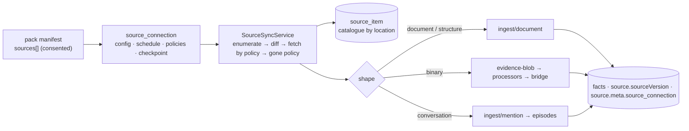

# Source plane — how brain reads what already exists

Roadmap and rationale: [raw-evidence-sources-2026-09](roadmap/raw-evidence-sources-2026-09.md).
This page is the operator's and the connector author's reference for what
shipped in W0. Everything is dark behind `SOURCE_PLANE_ENABLED` (default
off): the routes answer a bare 404, no job handler registers, nothing is
enqueued, no connector runs.



## The three layers

| Layer | Table | Identity | Owns |
|---|---|---|---|
| **Connection** | `source_connection` | one per (pack, source entry, operator decision) | config (never secrets), `credential` (tenant DB, the `domain_pack.webhookSecret` posture; W4 encrypts), `mode` (`synced` \| `linked`), `schedule` (`manual` \| `15m` \| `1h` \| `4h` \| `24h`), `contentPolicy` (`manifest` \| `text` \| `bytes`), `deletePolicy` (`close` \| `retract` \| `keep`), `fetchBudget`, `status`, `checkpoint`, its `source_registry` recorder (`sourceKey = vertical:recorder`), `ownerUserId` |
| **Catalogue** | `source_item` | by LOCATION — `(connectionId, externalId)` UNIQUE | `revision` last enumerated vs `fetchedRevision` the stored content came from, `state` (`seen` \| `fetched` \| `indexed` \| `gone`), links to what it produced (`documentId` / `assetId` / `episodeId`), `acl` snapshot, `firstSeenAt` / `lastSeenAt` / `goneAt` |
| **Evidence & facts** | existing | by content | untouched — the doors write through the same paths every other caller uses |

Why the catalogue is not `evidence_asset`: its identity is `byteHash`
UNIQUE NOT NULL — an item we have only *seen* has no bytes, and two
locations with identical bytes are one asset but two catalogue entries
with independent lifecycles.

## The engine, one run

1. **Enumerate** from the stored checkpoint (`null` ⇒ full walk); every
   descriptor is upserted into the catalogue with `lastSeenAt = run start`.
2. **Diff** — new / changed (`revision` moved past `fetchedRevision`, or
   never fetched, or resurrected) / unchanged / gone (an explicit `gone`
   delta on incremental runs; on full runs everything the walk did not
   touch).
3. **Fetch by policy** — `manifest` writes nothing but the row; `text` /
   `bytes` fetch every changed item, bounded by `fetchBudget` (the rest
   stay changed for the next run), through the door for its shape.
4. **Drift** — each fetch stamps the item's revision
   (`SourceVersionStamp {system: connector kind, ref: externalId, version:
   revision}`) onto the document header; the commit writer folds it into
   every derived fact's `source.sourceVersion`, and the existing drift
   sweep (pack-gated by `verificationRules: source_version_match`) marks
   facts read at older revisions stale.
5. **Gone** — `close` (default) stamps `validUntil = goneAt` on the open
   facts the item's document grounded (a deleted file is history, not a
   lie); `keep` marks the row only; `retract` closes today and gains the
   cascade with W1.
6. **Bookkeeping** — checkpoint, `lastSyncAt`, `lastSyncStatus`,
   counters; a queued run's counters are its `job_run.result`.

A re-run over an unchanged source is 0 fetches, 0 LLM calls. A connector
that throws mid-walk fails the run and keeps the rows it catalogued. Every
early exit is a named `skipped` (`flag_off`, `status_paused`,
`agent_host`, …); a connection whose connector is not installed records a
failed run, never a crash.

## Doors — shape decides the path

| Shape | Door | Provenance written |
|---|---|---|
| `document` | `DocumentIngestService.ingestDocument` (kind `source_document` unless the connector names one) | `originUri` (the item's, else `source://<connection>/<externalId>`), `occurredAt` = the source's clock, `contextRef` = the connection's vertical + recorder, `userId` = the owner, `source.meta.{source_connection, source_pack, source_id}`, internal header `sourceConnectionId` / `sourceItemId` / the four `sourceVersion*` keys |
| `structure` | the record envelope rendered deterministically (sorted attributes, relations, `updated_at`) → the document door, kind `source_record`, `source.meta.record_type` | as above — an unchanged record dedupes on `contentHash`, a changed attribute is a new document. The attribute → predicate candidate path (no LLM) lands with the first structure-shaped native (W4) |
| `binary` | `EvidenceUploadService.upload` (content-addressed, quarantine scan, processor dispatch for the pack) — the [evidence → document bridge](document-pipeline.md#the-evidence-bridge--bytes-become-a-document) carries text onward | recorder, vertical, owner, occurredAt |
| `conversation` | `IngestService.ingestMention` per turn (`speaker: text`, `conversationId`, `messageId`) → the episode substrate | recorder, vertical, owner, `emittedAt` |

## Operator surface (`brain:admin`)

| Route | Does |
|---|---|
| `GET /v1/admin/source-connections` | list |
| `GET /v1/admin/source-connections/catalog` | what this tenant can connect here: every `sources[]` entry of every pack it has (builtin + installed, with `accepted` = the sources section was consented at install) and its `availability` — `ready` / `disabled` (`SOURCE_KIND_<KIND>` off) / `missing` (not shipped in this build) / `agent` (stdio MCP) / `external` (the publisher pushes) — plus the connector's static `configExample` / `credentialHint`, the shipped connectors with their switches, `fsRoots` and `egressAllowPrivate`. Read-only, never runs a connector |
| `POST /v1/admin/source-connections` | `{ packId, sourceId, vertical, label?, host?, config?, credential?, mode?, schedule?, contentPolicy?, deletePolicy?, fetchBudget?, ownerUserId? }` — the pack must be installed with `acceptSources` (or builtin); a `native` entry must name an installed connector; defaults come from the entry; the recorder is declared in `source_registry` |
| `GET /v1/admin/source-connections/:id` | one (never the credential — `hasCredential`) |
| `PATCH /v1/admin/source-connections/:id` | label / config / credential / schedule / policies / `status: active \| paused` |
| `DELETE /v1/admin/source-connections/:id` | removes the connection and its catalogue; documents, assets and facts stay |
| `GET /v1/admin/source-connections/:id/items?state=&limit=&offset=` | the catalogue |
| `POST /v1/admin/source-connections/:id/sync` | `{ full?, inline? }` — enqueue a `source_sync` job (default) or run inline and return the summary |

The scheduler ticks every 5 minutes (`2-59/5 * * * *` UTC) and enqueues
one job per due connection per tenant, deduped per 5-minute slot;
`manual` connections are only synced by sync-now. The job handler
registers at boot — flip the flag, then restart.

### Admin UI — `/admin/connections`

The landing's admin shell mirrors the surface one-to-one (Platform →
Connections; `brain-landing/components/admin/ConnectionsPanel.tsx`):

- **Deployment fences** — the shipped connectors and their switches, the
  `fs` root jail, the private-egress opt-in — from `/catalog`, so an
  operator sees *why* a source cannot be connected before trying.
- **Connected** — every connection with schedule, status and last sync;
  **Sync** / **Full** enqueue a `source_sync` job (the notice names the
  run), **Pause** / **Resume** PATCH the status, **Delete** asks for the
  label back.
- **Inspect** opens the connection under the table: identity, config,
  checkpoint, last error, a **Run inline** that shows the run's counters,
  and the catalogue (`source_item`) paged and filterable by state.
- **Connect a source** — the catalogue of declarable entries; **Connect**
  opens a form pre-filled from the connector's `configExample` and the
  entry's defaults; the credential is a write-only field. A source whose
  pack was installed without `acceptSources` links back to Packs.

While `SOURCE_PLANE_ENABLED` is off the page shows the off-state with the
flag to set, nothing else. The Packs page's install flow asks for each
consent gate in turn (MCP tools → modalities → sources), carrying the
accepted flags into the retry.

## Natives

| Kind | Flag | Reads | Revision | Config |
|---|---|---|---|---|
| **`fs`** (W1) | `SOURCE_KIND_FS` + the `SOURCE_FS_ROOTS` jail | a directory on the brain host — a mounted volume, an OS-mounted network share (SMB/NFS), the laptop a fully-local brain runs on. Every run is a full walk (`walksEverything`: no change feed exists for a directory), so what the walk did not see is gone. Symlinks are never followed; hidden entries and VCS/build directories are skipped; `maxFiles` / `maxFileBytes` bound the walk | `mtime:size` — polling, hashing only what the store hashes on write | `{ root, extensions?, excludeDirs?, includeHidden?, maxFiles?, maxFileBytes? }` |
| **`url`** (W1) | `SOURCE_KIND_URL` | pages named outright and every page a sitemap lists (indexes followed one level) — a public site, a docs portal, a self-hosted wiki. HTML is reduced to text (title kept, scripts/styles/chrome stripped); `text/*` and JSON pass through; PDFs, office documents and rfc822 go to the binary shape. Every request and every redirect hop passes the SSRF egress guard; robots.txt `Disallow` for `*` and `inite-brain-source` is honoured per host; `sameHostOnly` (default) keeps a sitemap from enumerating another host; the credential rides as `Authorization: Bearer` (or `Basic`, or `header:<Name>`) | sitemap `<lastmod>`, else the server's ETag / Last-Modified (one HEAD per URL per run), else a `refetchHours` time bucket | `{ urls?, sitemaps?, maxPages?, sameHostOnly?, allowPrivate?, authScheme?, refetchHours?, delayMs?, maxBytes?, ignoreRobots? }` |
| **`s3`** (W1) | `SOURCE_KIND_S3` | objects under a prefix of an S3 or S3-compatible bucket (MinIO, R2, B2, GCS interop) through the SDK the evidence adapter already uses; the same extension rules as `fs` decide text vs binary items | the object ETag | `{ bucket, prefix?, region?, endpoint?, forcePathStyle?, allowPrivate?, extensions?, maxObjects?, maxObjectBytes? }`; credential `accessKeyId:secretAccessKey`, else the SDK chain |

**Private hosts — the double opt-in.** A self-hosted wiki or a MinIO on
the LAN is a legitimate source, but the SSRF fence is lowered only when
the operator who owns the network says so on the brain
(`SOURCE_EGRESS_ALLOW_PRIVATE=1`) **and** the connection that needs it
says so itself (`config.allowPrivate: true`). Either alone changes
nothing; with both, plain http is accepted for that connection. The
link-local metadata range (169.254.0.0/16) is refused even then.

Packs: **`file_memory`** carries `folder` / `folder_media` (`fs`) and
`bucket` / `bucket_media` (`s3`); **`web_memory`** carries `site` /
`site_media` (`url`) with its own vocabulary (`describes`, `links_to`,
`authored_by`) and derivable class (`published_on`, `canonical_url`).

The declared shape decides what the `fs` connector counts as an item:
`document` ⇒ text-like extensions read as UTF-8 (a file with NUL bytes is
skipped as binary; `.html` is reduced to its prose), `binary` ⇒ PDFs,
office documents (`.docx` / `.xlsx` / `.pptx`), mail (`.eml`) and images
handed to the evidence door. The table is one for `fs` and `s3`
(`src/source-plane/connectors/media.ts`). The first-party **`file_memory`** pack (`packs/file-memory.pack.json`)
carries both entries — `folder` and `folder_media` — plus the vocabulary
a folder of documents yields (`describes`, `defines_term`, `references`)
and the derivable class the drift sweep re-verifies (`located_in`,
`last_modified`). Install it with `--accept-sources --accept-modalities`,
then:

```bash
curl -X POST $BRAIN/v1/admin/source-connections -H "Authorization: Bearer $KEY" \
  -d '{"packId":"file_memory","sourceId":"folder","vertical":"files","config":{"root":"/srv/brain/sources/vault"}}'
curl -X POST $BRAIN/v1/admin/source-connections/<id>/sync -d '{"inline":true}'
```

**What a binary item becomes.** The evidence plane's processors turn the
bytes into text and the bridge (`EVIDENCE_DOCUMENT_BRIDGE`) carries that
text into the document pipeline, so a `.docx` on a share ends as facts
with `file://` provenance exactly like a `.md` would:

| Bytes | Processor | Output |
|---|---|---|
| PDF | `document-pdf-text` (pdf2json) | `[page i of n]`-marked text |
| `.docx` / `.xlsx` / `.pptx` | `document-office-text` — zero-dependency OOXML reader (`zip-reader.ts` + `ooxml-text.ts`): only the named parts are inflated, each under the derived-output cap, the directory under a count — a crafted archive is a failed run, never an OOM; no XML parser, so no XXE | paragraphs / `[sheet: …]` rows tab-separated / `[slide i of n]` |
| `.eml` | `document-mail-text` — RFC 5322 + MIME, bounded by part count and depth; RFC 2047 words, quoted-printable / base64, charsets; attachments named, never read | `From/To/Cc/Date/Subject`, the first text body (HTML reduced), `[attachment: …]` lines |
| images | `image-metadata`, OCR (opt-in) | header read / text |

Macro-enabled containers (`.docm` / `.xlsm` / `.pptm`) stay outside the
upload allowlist and the walk.

with `SOURCE_FS_ROOTS=/srv/brain/sources` on the brain. `config.root`
must resolve (realpath) inside a listed root — unset means no directory is
permitted: brain's own process reading arbitrary host paths is a
capability an operator grants by name. A network share is connected by
mounting it into that root; a laptop's folders by running the brain
there (the local agent, W3, is the no-mount alternative).

## Writing a connector (platform code)

```ts
interface Connector {
  readonly kind: string;                 // what a pack's `native.connector` names
  enumerate(ctx, { checkpoint, full }): AsyncIterable<
    | { type: 'upsert'; item: ItemDescriptor }      // externalId, revision, modifiedAt, originUri, title, mediaType, size, acl
    | { type: 'gone'; externalId: string }
    | { type: 'checkpoint'; checkpoint: Record<string, unknown> }>;
  fetch(ctx, item): Promise<FetchedItem>;  // { shape: 'document', text } | { shape: 'binary', bytes, mediaType, modality } | { shape: 'conversation', conversationId, turns } | { shape: 'structure', record }
  readonly configExample?: Record<string, unknown>;  // what the admin form pre-fills — keys with example values, never secrets
  readonly credentialHint?: string;                  // one line on what `credential` is, when the connector takes one
}
```

Register it in the `SOURCE_CONNECTORS` array (`src/source-plane/
source-plane.module.ts`, the `EVIDENCE_PROCESSOR_ADAPTERS` mold). `ctx`
carries the connection view (config, resolved credential, vertical,
recorder, owner), an abort signal and a logger. Rules: `enumerate` never
reads bytes; `revision` is the source's own token (etag, revisionId,
mtime+size, commit) — no revision, no drift stamp; on a `full` walk emit
every live item; emit `checkpoint` last. A connector is platform code: a
pack may only name it.

## Flags

| Flag | Default | Effect |
|---|---|---|
| `SOURCE_PLANE_ENABLED` | `0` | the surface, the engine, the scheduler |
| `SOURCE_KIND_FS` / `SOURCE_FS_ROOTS` | `0` / unset | the `fs` native and its root jail (W1) |
| `SOURCE_KIND_URL`, `SOURCE_KIND_S3` | `0` | the `url` and `s3` natives (W1) |
| `SOURCE_EGRESS_ALLOW_PRIVATE` | `0` | operator half of the private-host double opt-in |
| `DOCUMENT_INGEST_ENABLED` | `1` | the document door (default on) |
| `EVIDENCE_*`, `EVIDENCE_DOCUMENT_BRIDGE` | `0` | the binary door and its bridge to facts |
| `PACK_SOURCE_VERSION_STALENESS` | `0` | the drift sweep the stamps feed |

## See also

- [domain-packs.md § Sources](domain-packs.md#sources-consumed) — the manifest section and consent
- [document-pipeline.md](document-pipeline.md) — what happens after the door
- [indexer-protocol.md](indexer-protocol.md) — the `external` kind's push side
