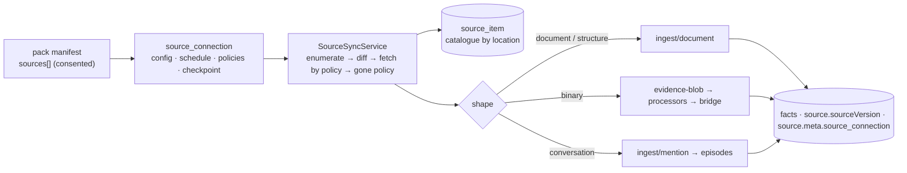

# Source plane — how brain reads what already exists

Roadmap and rationale: [raw-evidence-sources-2026-09](roadmap/raw-evidence-sources-2026-09.md).
This page is the operator's and the connector author's reference for what
shipped in W0. Everything is dark behind `SOURCE_PLANE_ENABLED` (default
off): the routes answer a bare 404, no job handler registers, nothing is
enqueued, no connector runs.



## The three layers

| Layer | Table | Identity | Owns |
|---|---|---|---|
| **Connection** | `source_connection` | one per (pack, source entry, operator decision) | config (never secrets), `credential` (tenant DB, the `domain_pack.webhookSecret` posture; W4 encrypts), `mode` (`synced` \| `linked`), `schedule` (`manual` \| `15m` \| `1h` \| `4h` \| `24h`), `contentPolicy` (`manifest` \| `text` \| `bytes`), `deletePolicy` (`close` \| `retract` \| `keep`), `fetchBudget`, `status`, `checkpoint`, its `source_registry` recorder (`sourceKey = vertical:recorder`), `ownerUserId` |
| **Catalogue** | `source_item` | by LOCATION — `(connectionId, externalId)` UNIQUE | `revision` last enumerated vs `fetchedRevision` the stored content came from, `state` (`seen` \| `fetched` \| `indexed` \| `gone`), links to what it produced (`documentId` / `assetId` / `episodeId`), `acl` snapshot, `firstSeenAt` / `lastSeenAt` / `goneAt` |
| **Evidence & facts** | existing | by content | untouched — the doors write through the same paths every other caller uses |

Why the catalogue is not `evidence_asset`: its identity is `byteHash`
UNIQUE NOT NULL — an item we have only *seen* has no bytes, and two
locations with identical bytes are one asset but two catalogue entries
with independent lifecycles.

## The engine, one run

1. **Enumerate** from the stored checkpoint (`null` ⇒ full walk); every
   descriptor is upserted into the catalogue with `lastSeenAt = run start`.
2. **Diff** — new / changed (`revision` moved past `fetchedRevision`, or
   never fetched, or resurrected) / unchanged / gone (an explicit `gone`
   delta on incremental runs; on full runs everything the walk did not
   touch).
3. **Fetch by policy** — `manifest` writes nothing but the row; `text` /
   `bytes` fetch every changed item, bounded by `fetchBudget` (the rest
   stay changed for the next run), through the door for its shape.
4. **Drift** — each fetch stamps the item's revision
   (`SourceVersionStamp {system: connector kind, ref: externalId, version:
   revision}`) onto the document header; the commit writer folds it into
   every derived fact's `source.sourceVersion`, and the existing drift
   sweep (pack-gated by `verificationRules: source_version_match`) marks
   facts read at older revisions stale.
5. **Gone** — `close` (default) stamps `validUntil = goneAt` on the open
   facts the item's document grounded (a deleted file is history, not a
   lie); `keep` marks the row only; `retract` closes today and gains the
   cascade with W1.
6. **Bookkeeping** — checkpoint, `lastSyncAt`, `lastSyncStatus`,
   counters; a queued run's counters are its `job_run.result`.

A re-run over an unchanged source is 0 fetches, 0 LLM calls. A connector
that throws mid-walk fails the run and keeps the rows it catalogued. Every
early exit is a named `skipped` (`flag_off`, `status_paused`,
`agent_host`, …); a connection whose connector is not installed records a
failed run, never a crash.

## Doors — shape decides the path

| Shape | Door | Provenance written |
|---|---|---|
| `document` | `DocumentIngestService.ingestDocument` (kind `source_document` unless the connector names one) | `originUri` (the item's, else `source://<connection>/<externalId>`), `occurredAt` = the source's clock, `contextRef` = the connection's vertical + recorder, `userId` = the owner, `source.meta.{source_connection, source_pack, source_id}`, internal header `sourceConnectionId` / `sourceItemId` / the four `sourceVersion*` keys |
| `structure` | the record envelope rendered deterministically (sorted attributes, relations, `updated_at`) → the document door, kind `source_record`, `source.meta.record_type` | as above — an unchanged record dedupes on `contentHash`, a changed attribute is a new document. The attribute → predicate candidate path (no LLM) lands with the first structure-shaped native (W4) |
| `binary` | `EvidenceUploadService.upload` (content-addressed, quarantine scan, processor dispatch for the pack) — the [evidence → document bridge](document-pipeline.md#the-evidence-bridge--bytes-become-a-document) carries text onward | recorder, vertical, owner, occurredAt |
| `conversation` | `IngestService.ingestMention` per turn (`speaker: text`, `conversationId`, `messageId`) → the episode substrate | recorder, vertical, owner, `emittedAt` |

## Operator surface (`brain:admin`)

| Route | Does |
|---|---|
| `GET /v1/admin/source-connections` | list |
| `POST /v1/admin/source-connections` | `{ packId, sourceId, vertical, label?, host?, config?, credential?, mode?, schedule?, contentPolicy?, deletePolicy?, fetchBudget?, ownerUserId? }` — the pack must be installed with `acceptSources` (or builtin); a `native` entry must name an installed connector; defaults come from the entry; the recorder is declared in `source_registry` |
| `GET /v1/admin/source-connections/:id` | one (never the credential — `hasCredential`) |
| `PATCH /v1/admin/source-connections/:id` | label / config / credential / schedule / policies / `status: active \| paused` |
| `DELETE /v1/admin/source-connections/:id` | removes the connection and its catalogue; documents, assets and facts stay |
| `GET /v1/admin/source-connections/:id/items?state=&limit=&offset=` | the catalogue |
| `POST /v1/admin/source-connections/:id/sync` | `{ full?, inline? }` — enqueue a `source_sync` job (default) or run inline and return the summary |

The scheduler ticks every 5 minutes (`2-59/5 * * * *` UTC) and enqueues
one job per due connection per tenant, deduped per 5-minute slot;
`manual` connections are only synced by sync-now. The job handler
registers at boot — flip the flag, then restart.

## Writing a connector (platform code)

```ts
interface Connector {
  readonly kind: string;                 // what a pack's `native.connector` names
  enumerate(ctx, { checkpoint, full }): AsyncIterable<
    | { type: 'upsert'; item: ItemDescriptor }      // externalId, revision, modifiedAt, originUri, title, mediaType, size, acl
    | { type: 'gone'; externalId: string }
    | { type: 'checkpoint'; checkpoint: Record<string, unknown> }>;
  fetch(ctx, item): Promise<FetchedItem>;  // { shape: 'document', text } | { shape: 'binary', bytes, mediaType, modality } | { shape: 'conversation', conversationId, turns } | { shape: 'structure', record }
}
```

Register it in the `SOURCE_CONNECTORS` array (`src/source-plane/
source-plane.module.ts`, the `EVIDENCE_PROCESSOR_ADAPTERS` mold). `ctx`
carries the connection view (config, resolved credential, vertical,
recorder, owner), an abort signal and a logger. Rules: `enumerate` never
reads bytes; `revision` is the source's own token (etag, revisionId,
mtime+size, commit) — no revision, no drift stamp; on a `full` walk emit
every live item; emit `checkpoint` last. A connector is platform code: a
pack may only name it.

## Flags

| Flag | Default | Effect |
|---|---|---|
| `SOURCE_PLANE_ENABLED` | `0` | the surface, the engine, the scheduler |
| `SOURCE_KIND_<X>` | — | per-native switches, W1+ |
| `DOCUMENT_INGEST_ENABLED` | `1` | the document door (default on) |
| `EVIDENCE_*`, `EVIDENCE_DOCUMENT_BRIDGE` | `0` | the binary door and its bridge to facts |
| `PACK_SOURCE_VERSION_STALENESS` | `0` | the drift sweep the stamps feed |

## See also

- [domain-packs.md § Sources](domain-packs.md#sources-consumed) — the manifest section and consent
- [document-pipeline.md](document-pipeline.md) — what happens after the door
- [indexer-protocol.md](indexer-protocol.md) — the `external` kind's push side
