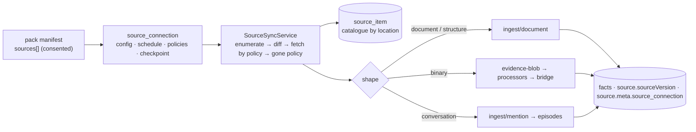

# Source plane — how brain reads what already exists

Roadmap and rationale: [raw-evidence-sources-2026-09](roadmap/raw-evidence-sources-2026-09.md).
This page is the operator's and the connector author's reference for what
shipped in W0. Everything is dark behind `SOURCE_PLANE_ENABLED` (default
off): the routes answer a bare 404, no job handler registers, nothing is
enqueued, no connector runs.



## The three layers

| Layer | Table | Identity | Owns |
|---|---|---|---|
| **Connection** | `source_connection` | one per (pack, source entry, operator decision) | config (never secrets), `credential` (tenant DB, the `domain_pack.webhookSecret` posture; W4 encrypts), `mode` (`synced` \| `linked`), `schedule` (`manual` \| `15m` \| `1h` \| `4h` \| `24h`), `contentPolicy` (`manifest` \| `text` \| `bytes`), `deletePolicy` (`close` \| `retract` \| `keep`), `fetchBudget`, `status`, `checkpoint`, its `source_registry` recorder (`sourceKey = vertical:recorder`), `ownerUserId` |
| **Catalogue** | `source_item` | by LOCATION — `(connectionId, externalId)` UNIQUE | `revision` last enumerated vs `fetchedRevision` the stored content came from, `state` (`seen` \| `fetched` \| `indexed` \| `gone`), links to what it produced (`documentId` / `assetId` / `episodeId`), `acl` snapshot, `firstSeenAt` / `lastSeenAt` / `goneAt` |
| **Evidence & facts** | existing | by content | untouched — the doors write through the same paths every other caller uses |

Why the catalogue is not `evidence_asset`: its identity is `byteHash`
UNIQUE NOT NULL — an item we have only *seen* has no bytes, and two
locations with identical bytes are one asset but two catalogue entries
with independent lifecycles.

## The engine, one run

1. **Enumerate** from the stored checkpoint (`null` ⇒ full walk); every
   descriptor is upserted into the catalogue with `lastSeenAt = run start`.
2. **Diff** — new / changed (`revision` moved past `fetchedRevision`, or
   never fetched, or resurrected) / unchanged / gone (an explicit `gone`
   delta on incremental runs; on full runs everything the walk did not
   touch).
3. **Fetch by policy** — `manifest` writes nothing but the row; `text` /
   `bytes` fetch every changed item, bounded by `fetchBudget` (the rest
   stay changed for the next run), through the door for its shape.
4. **Drift** — each fetch stamps the item's revision
   (`SourceVersionStamp {system: connector kind, ref: externalId, version:
   revision}`) onto the document header; the commit writer folds it into
   every derived fact's `source.sourceVersion`, and the existing drift
   sweep (pack-gated by `verificationRules: source_version_match`) marks
   facts read at older revisions stale.
5. **Gone** — `close` (default) stamps `validUntil = goneAt` on the open
   facts the item's document grounded (a deleted file is history, not a
   lie); `keep` marks the row only; `retract` closes today and gains the
   cascade with W1.
6. **Bookkeeping** — checkpoint, `lastSyncAt`, `lastSyncStatus`,
   counters; a queued run's counters are its `job_run.result`.

A re-run over an unchanged source is 0 fetches, 0 LLM calls. A connector
that throws mid-walk fails the run and keeps the rows it catalogued. Every
early exit is a named `skipped` (`flag_off`, `status_paused`,
`agent_host`, …); a connection whose connector is not installed records a
failed run, never a crash.

## Doors — shape decides the path

| Shape | Door | Provenance written |
|---|---|---|
| `document` | `DocumentIngestService.ingestDocument` (kind `source_document` unless the connector names one) | `originUri` (the item's, else `source://<connection>/<externalId>`), `occurredAt` = the source's clock, `contextRef` = the connection's vertical + recorder, `userId` = the owner, `source.meta.{source_connection, source_pack, source_id}`, internal header `sourceConnectionId` / `sourceItemId` / the four `sourceVersion*` keys |
| `structure` | the record envelope rendered deterministically (sorted attributes, relations, `updated_at`) → the document door, kind `source_record`, `source.meta.record_type` | as above — an unchanged record dedupes on `contentHash`, a changed attribute is a new document. The attribute → predicate candidate path (no LLM) lands with the first structure-shaped native (W4) |
| `binary` | `EvidenceUploadService.upload` (content-addressed, quarantine scan, processor dispatch for the pack) — the [evidence → document bridge](document-pipeline.md#the-evidence-bridge--bytes-become-a-document) carries text onward | recorder, vertical, owner, occurredAt, and the same header as the document door on the asset's `meta` (`sourceConnectionId`, `sourceItemId`, the four `sourceVersion*` keys, the three `source_*` labels) — the bridge folds it into every document it makes of the asset, so bridged facts are stamped for the drift sweep and `deletePolicy: close` finds them (by `meta.evidenceAssetId`) when the item goes |
| `conversation` | `IngestService.ingestMention` per turn (`speaker: text`, `conversationId`, `messageId`) → the episode substrate | recorder, vertical, owner, `emittedAt` |

## Operator surface (`brain:admin`)

| Route | Does |
|---|---|
| `GET /v1/admin/source-connections` | list |
| `GET /v1/admin/source-connections/catalog` | what this tenant can connect here: every `sources[]` entry of every pack it has (builtin + installed, with `accepted` = the sources section was consented at install) and its `availability` — `ready` / `disabled` (`SOURCE_KIND_<KIND>` off) / `missing` (not shipped in this build) / `agent` (stdio MCP) / `external` (the publisher pushes) — plus the connector's static `configExample` / `credentialHint`, `hosts` (where a connection may run: `server` and/or `agent`), the MCP entry's declared transport (`mcp.{transport, url, auth, command, args}` — a pinned url is read-only, null = the operator names it), the shipped connectors with their switches, `fsRoots` and `egressAllowPrivate`. Read-only, never runs a connector |
| `POST /v1/admin/source-connections` | `{ packId, sourceId, vertical, label?, host?, config?, credential?, mode?, schedule?, contentPolicy?, deletePolicy?, fetchBudget?, ownerUserId? }` — the pack must be installed with `acceptSources` (or builtin); a `native` entry must name an installed connector; defaults come from the entry; the recorder is declared in `source_registry` |
| `GET /v1/admin/source-connections/:id` | one (never the credential — `hasCredential`) |
| `PATCH /v1/admin/source-connections/:id` | label / config / credential / schedule / policies / `status: active \| paused` |
| `DELETE /v1/admin/source-connections/:id` | removes the connection and its catalogue; documents, assets and facts stay |
| `GET /v1/admin/source-connections/:id/items?state=&limit=&offset=` | the catalogue |
| `POST /v1/admin/source-connections/:id/sync` | `{ full?, inline? }` — enqueue a `source_sync` job (default) or run inline and return the summary; an inline run is a `source_sync` job_run of its own (actor = the caller), so it shows in the Jobs cockpit and the history like a queued one |
| `GET /v1/admin/source-connections/:id/stats` | what the connection produced: catalogue rows by state, and the facts it grounds (`source.meta.source_connection`) as active / stale / closed — a bounded scan, `facts: null` when the tenant is too large to count in 5 s |
| `GET /v1/admin/source-connections/:id/runs?limit=` | every run, newest first — queued (`payload.connectionId`), inline and agent (`progress.connectionId`) runs alike, projected to `ranBy` (`server` / `agent:<id>`), mode, counters, duration, error; `persisted: false` under `JOB_RUN_PERSIST=0` |
| `GET /v1/admin/source-connections/:id/items/:itemId` | one catalogue row followed to its facts: the document it became (or the asset it was stored as, its current derived representations, and the documents the bridge made of it) and up to 50 facts that cite those documents with the revision each was read at, its stale mark and its close. 404 when the row belongs to another connection |

The scheduler ticks every 5 minutes (`2-59/5 * * * *` UTC) and enqueues
one job per due connection per tenant, deduped per 5-minute slot;
`manual` connections are only synced by sync-now. The job handler
registers at boot — flip the flag, then restart.

### Admin UI — `/admin/connections`

The landing's admin shell mirrors the surface one-to-one (Platform →
Connections; `brain-landing/components/admin/ConnectionsPanel.tsx`):

- **Deployment fences** — the shipped connectors and their switches, the
  `fs` root jail, the private-egress opt-in — from `/catalog`, so an
  operator sees *why* a source cannot be connected before trying.
- **Connected** — every connection with schedule, status and last sync;
  **Sync** / **Full** enqueue a `source_sync` job (the notice names the
  run), **Pause** / **Resume** PATCH the status, **Delete** asks for the
  label back.
- **Inspect** opens the connection under the table: the pack's source
  entry it instantiates, where it runs (brain / `local agent <id>`),
  identity, config, checkpoint, last error; **Produced** (`/stats`:
  catalogue rows by state, facts active / stale / closed); **Runs**
  (`/runs`: every sync with who ran it, mode, counters, duration, a link
  into the Jobs cockpit); a **Run inline** that shows the run's
  counters; and the catalogue (`source_item`) paged and filterable by
  state — every row opens (`/items/:itemId`) to the item at the source,
  the document(s) it became, the evidence asset and what the processors
  extracted, and the facts it grounds with the revision each was read
  at (`current` / `drifted` / `stale` / `closed`).
- **Local agents** — agent-host connections grouped by agent id with
  their last activity and the command to run the agent on that machine
  (a `brain:write` key of the tenant, never an admin key). Sync / Full
  are disabled on agent-host rows: the agent runs them.
- **Connect a source** — one card per KIND of thing the packs here can
  read (Folder, Website, S3 bucket, MCP server, Git repository, pushed
  by a publisher), in plain words, with whether it can be connected now
  and what to do if not (the switch to set, the agent to run, the pack
  to reinstall); a pack's per-shape entries (text documents vs. files)
  fold into one card and become the flow's "what's in it" question
  (`components/admin/connections/kinds.ts`). **Connect** opens a
  three-step flow: *where it runs* (the brain or a local agent —
  offered only when the entry's `hosts` allows both; agent id when on an
  agent), *the source* (the connector's own typed fields — a folder and
  its extensions, pages / sitemaps and their auth, a bucket and its
  endpoint, an MCP server's URL and resource filters, a repository's
  path and include globs — validated as the brain would: absolute paths,
  "what's in it" (documents / files / both — both creates two
  connections over the same place, one per shape),
  the `fs` root jail with the allowed roots named, http(s) URLs, a token
  once an auth is chosen; rarely-set keys under *Advanced*, the exact
  JSON the brain receives one click away, and the JSON editor as the
  default only for a connector this build has no form for), *how it
  syncs* (schedule, what to take, what to do when an item disappears, as
  cards with the pack's defaults preselected). Specs live in
  `components/admin/connections/create/specs.ts` and are unit-tested
  without React. A source whose pack was installed without
  `acceptSources` links back to Packs.

While `SOURCE_PLANE_ENABLED` is off the page shows the off-state with the
flag to set, nothing else. The Packs page's install flow asks for each
consent gate in turn (MCP tools → modalities → sources), carrying the
accepted flags into the retry.

## Natives

| Kind | Flag | Reads | Revision | Config |
|---|---|---|---|---|
| **`fs`** (W1) | `SOURCE_KIND_FS` + the `SOURCE_FS_ROOTS` jail | a directory on the brain host — a mounted volume, an OS-mounted network share (SMB/NFS), the laptop a fully-local brain runs on. Every run is a full walk (`walksEverything`: no change feed exists for a directory), so what the walk did not see is gone. Symlinks are never followed; hidden entries and VCS/build directories are skipped; `maxFiles` / `maxFileBytes` bound the walk | `mtime:size` — polling, hashing only what the store hashes on write | `{ root, extensions?, excludeDirs?, includeHidden?, maxFiles?, maxFileBytes? }` |
| **`url`** (W1) | `SOURCE_KIND_URL` | pages named outright and every page a sitemap lists (indexes followed one level) — a public site, a docs portal, a self-hosted wiki. HTML is reduced to text (title kept, scripts/styles/chrome stripped); `text/*` and JSON pass through; PDFs, office documents and rfc822 go to the binary shape. Every request and every redirect hop passes the SSRF egress guard; robots.txt `Disallow` for `*` and `inite-brain-source` is honoured per host; `sameHostOnly` (default) keeps a sitemap from enumerating another host; the credential rides as `Authorization: Bearer` (or `Basic`, or `header:<Name>`) | sitemap `<lastmod>`, else the server's ETag / Last-Modified (one HEAD per URL per run), else a `refetchHours` time bucket | `{ urls?, sitemaps?, maxPages?, sameHostOnly?, allowPrivate?, authScheme?, refetchHours?, delayMs?, maxBytes?, ignoreRobots? }` |
| **`s3`** (W1) | `SOURCE_KIND_S3` | objects under a prefix of an S3 or S3-compatible bucket (MinIO, R2, B2, GCS interop) through the SDK the evidence adapter already uses; the same extension rules as `fs` decide text vs binary items | the object ETag | `{ bucket, prefix?, region?, endpoint?, forcePathStyle?, allowPrivate?, extensions?, maxObjects?, maxObjectBytes? }`; credential `accessKeyId:secretAccessKey`, else the SDK chain |

### `mcp` — the harvester (W2)

| Kind | Flag | Reads | Revision | Config |
|---|---|---|---|---|
| **`mcp`** | `SOURCE_KIND_MCP` | an MCP server's **resources** over Streamable HTTP — a wiki, a docs portal, a knowledge base, a drive that speaks MCP. `resources/list` (paged) is the catalogue and is re-walked every run (`walksEverything`: a resource the listing no longer carries is gone); `resources/read` is the fetch — text contents to the document door, blobs (PDF, office, images) to the evidence door per the entry's shape. Resource *templates* need arguments and are not enumerated. The server is a peer that supplies DATA: never tools, never prompts — resources enter the ordinary doors under the connection's own recorder and stamp | `annotations.lastModified` (`lm:<iso>`); a resource without one gets a `refetchHours` time bucket and the store's content hash makes an unchanged re-read a dedup | `{ url? (operator-named entries only), allowPrivate?, uriPrefixes?, mimeTypes?, maxResources?, maxBytes?, refetchHours?, authScheme? }`; credential = the bearer the server expects (`header:<Name>` to send it as another header) |

**Who names the server.** A pack's `{ kind: 'mcp', transport: 'http' }`
entry either **pins** `url` — the publisher operates the server; with
`auth: install_secret` brain authenticates with the pack's own install
secret as the bearer, the same secret its external tools are signed
with — or leaves `url` **absent**: the operator names the server on the
connection (`config.url`), the egress guard runs at create, and the
consent at install reads "an MCP server the operator names". A pinned
entry refuses a `config.url`; a named entry requires one. `auth: oauth`
is W4 and fails by name.

Every request the SDK client makes leaves through the egress guard
(`guardedFetch`: each URL checked, redirects never followed, the
private-host double opt-in as everywhere). One client session lives
exactly one run — `enumerate` opens it, `fetch` reuses it, the engine's
`endRun` closes it.

**`web_memory`** carries the generic entries — `mcp_resources` (text)
and `mcp_resources_media` (blobs) — because a server's pages are pages:
the same vocabulary as a crawled site. A CRM's records are a different
shape and land with the record envelope (W4).

```bash
curl -X POST $BRAIN/v1/admin/source-connections -H "Authorization: Bearer $KEY" \
  -d '{"packId":"web_memory","sourceId":"mcp_resources","vertical":"wiki",
       "config":{"url":"https://wiki.example.com/mcp","uriPrefixes":["wiki://"]},"credential":"<token>"}'
```

### The local agent (W3) — `@inite/brain-agent`

The connector's other host. An operator points a connection at an agent
(**Admin → Connections → Connect → where it runs: on a local agent**,
host `agent:<id>`); the agent (`clients/brain-agent`) asks the brain
which connections are its, walks the folders / repositories / stdio MCP
servers on its own machine, and speaks the **agent protocol** — the
engine's bookkeeping over HTTP:

| Route (`brain:write`) | Does |
|---|---|
| `GET /v1/source-connections?host=agent:<id>` | the agent's connections, each with the pack entry it runs |
| `POST /v1/source-connections/:id/agent-runs` | `{ agentId, full? }` — begin: a `source_sync` job_run (actor `agent:<id>`); answers whether the walk is full, the checkpoint, the content policy, the fetch budget; one running run per connection (409) |
| `POST …/agent-runs/:runId/deltas` | up to 1000 `upsert` / `gone` / `checkpoint` deltas → the catalogue, exactly as a server walk; answers with the externalIds whose revision moved |
| `POST …/agent-runs/:runId/items` | `{ externalId, item }` — the content in the seam's shape (binary as base64), through the door for its shape under the connection's recorder and stamp; `skipped` under `manifest` policy or a spent budget |
| `POST …/agent-runs/:runId/finish` | `{ status, error?, checkpoint? }` — a full run marks what it did not see gone, the delete policy runs over everything gone since the run began, the checkpoint is recorded; the summary is the job's result |

Agent connectors: `fs` (the brain's walking rules; `BRAIN_AGENT_ROOTS`
fences it when the agent serves others), **`git`** — a repository's
committed docs with the blob sha as revision and the last commit
touching each file as its time (`code_memory/repo_docs`; git runs on the
agent, never in the brain), and **`mcp` over stdio** — the server the
pack names, spawned per run. Text is **redacted locally** before it
leaves (cloud keys, tokens, private keys, bearer headers, `secret=value`)
— `--no-redact` opts out. The key is a tenant write key; an agent reaches
only the connections an operator pointed at its host. A CI recipe (the
repo's docs after every push) is in the package README.

**Installing one.** **Admin → Connections → Local agents → Set up an
agent** names the machine and issues a `brain:write` key labelled
`agent:<id>` (the self-serve `POST /v1/keys`, narrowed to what the admin
credential holds), shown once with the command filled in:
`npx @inite/brain-agent install --url … --key … --agent <id>`. `install`
writes the config (`~/.config/brain-agent/config.json`, mode 0600 — the
only place the key lives; the environment overrides it field by field)
and registers a service that syncs every few minutes and survives
reboots — a launchd user agent on macOS, a systemd user unit on Linux;
neither file carries the key. `brain-agent status` / `doctor` /
`uninstall` afterwards; `doctor` names the fix for each failure (a
refused key, the source plane off on the brain, a missing root, no git).
The CI shape needs no file: the key rides in the environment,
`brain-agent sync` exits 2 when a connection failed. Publishing the
package is `.github/workflows/publish-clients.yml` (workflow_dispatch;
npm trusted publishing or the `NPM_TOKEN` secret).

An agent-host connection needs no server connector: `SOURCE_KIND_FS`
may stay off, `git` has no server connector at all (the catalogue says
`agent`), and the pack entry's `stdio` MCP command is the agent's to
spawn. `SOURCE_PLANE_ENABLED` and job_run persistence are the two things
the brain needs.

**Private hosts — the double opt-in.** A self-hosted wiki or a MinIO on
the LAN is a legitimate source, but the SSRF fence is lowered only when
the operator who owns the network says so on the brain
(`SOURCE_EGRESS_ALLOW_PRIVATE=1`) **and** the connection that needs it
says so itself (`config.allowPrivate: true`). Either alone changes
nothing; with both, plain http is accepted for that connection. The
link-local metadata range (169.254.0.0/16) is refused even then.

Packs: **`file_memory`** carries `folder` / `folder_media` (`fs`) and
`bucket` / `bucket_media` (`s3`); **`web_memory`** carries `site` /
`site_media` (`url`) with its own vocabulary (`describes`, `links_to`,
`authored_by`) and derivable class (`published_on`, `canonical_url`).

The declared shape decides what the `fs` connector counts as an item:
`document` ⇒ text-like extensions read as UTF-8 (a file with NUL bytes is
skipped as binary; `.html` is reduced to its prose), `binary` ⇒ PDFs,
office documents (`.docx` / `.xlsx` / `.pptx`), mail (`.eml`) and images
handed to the evidence door. The table is one for `fs` and `s3`
(`src/source-plane/connectors/media.ts`). The first-party **`file_memory`** pack (`packs/file-memory.pack.json`)
carries both entries — `folder` and `folder_media` — plus the vocabulary
a folder of documents yields (`describes`, `defines_term`, `references`)
and the derivable class the drift sweep re-verifies (`located_in`,
`last_modified`). Install it with `--accept-sources --accept-modalities`,
then:

```bash
curl -X POST $BRAIN/v1/admin/source-connections -H "Authorization: Bearer $KEY" \
  -d '{"packId":"file_memory","sourceId":"folder","vertical":"files","config":{"root":"/srv/brain/sources/vault"}}'
curl -X POST $BRAIN/v1/admin/source-connections/<id>/sync -d '{"inline":true}'
```

**What a binary item becomes.** The evidence plane's processors turn the
bytes into text and the bridge (`EVIDENCE_DOCUMENT_BRIDGE`) carries that
text into the document pipeline, so a `.docx` on a share ends as facts
with `file://` provenance exactly like a `.md` would:

| Bytes | Processor | Output |
|---|---|---|
| PDF | `document-pdf-text` (pdf2json) | `[page i of n]`-marked text |
| `.docx` / `.xlsx` / `.pptx` | `document-office-text` — zero-dependency OOXML reader (`zip-reader.ts` + `ooxml-text.ts`): only the named parts are inflated, each under the derived-output cap, the directory under a count — a crafted archive is a failed run, never an OOM; no XML parser, so no XXE | paragraphs / `[sheet: …]` rows tab-separated / `[slide i of n]` |
| `.eml` | `document-mail-text` — RFC 5322 + MIME, bounded by part count and depth; RFC 2047 words, quoted-printable / base64, charsets; attachments named, never read | `From/To/Cc/Date/Subject`, the first text body (HTML reduced), `[attachment: …]` lines |
| images | `image-metadata`, OCR (opt-in) | header read / text |

Macro-enabled containers (`.docm` / `.xlsm` / `.pptm`) stay outside the
upload allowlist and the walk.

with `SOURCE_FS_ROOTS=/srv/brain/sources` on the brain. `config.root`
must resolve (realpath) inside a listed root — unset means no directory is
permitted: brain's own process reading arbitrary host paths is a
capability an operator grants by name. A network share is connected by
mounting it into that root; a laptop's folders by running the brain
there (the local agent, W3, is the no-mount alternative).

## Writing a connector (platform code)

```ts
interface Connector {
  readonly kind: string;                 // what a pack's `native.connector` names
  enumerate(ctx, { checkpoint, full }): AsyncIterable<
    | { type: 'upsert'; item: ItemDescriptor }      // externalId, revision, modifiedAt, originUri, title, mediaType, size, acl
    | { type: 'gone'; externalId: string }
    | { type: 'checkpoint'; checkpoint: Record<string, unknown> }>;
  fetch(ctx, item): Promise<FetchedItem>;  // { shape: 'document', text } | { shape: 'binary', bytes, mediaType, modality } | { shape: 'conversation', conversationId, turns } | { shape: 'structure', record }
  endRun?(ctx): Promise<void>;             // release a session held across enumerate + fetch (the engine calls it in finally)
  readonly configExample?: Record<string, unknown>;  // what the admin form pre-fills — keys with example values, never secrets
  readonly credentialHint?: string;                  // one line on what `credential` is, when the connector takes one
}
```

Register it in the `SOURCE_CONNECTORS` array (`src/source-plane/
source-plane.module.ts`, the `EVIDENCE_PROCESSOR_ADAPTERS` mold). `ctx`
carries the connection view (config, resolved credential, vertical,
recorder, owner, the pack entry it instantiates as `source`), an abort
signal and a logger. Rules: `enumerate` never
reads bytes; `revision` is the source's own token (etag, revisionId,
mtime+size, commit) — no revision, no drift stamp; on a `full` walk emit
every live item; emit `checkpoint` last. A connector is platform code: a
pack may only name it.

## Flags

| Flag | Default | Effect |
|---|---|---|
| `SOURCE_PLANE_ENABLED` | `0` | the surface, the engine, the scheduler |
| `SOURCE_KIND_FS` / `SOURCE_FS_ROOTS` | `0` / unset | the `fs` native and its root jail (W1) |
| `SOURCE_KIND_URL`, `SOURCE_KIND_S3` | `0` | the `url` and `s3` natives (W1) |
| `SOURCE_KIND_MCP` | `0` | the `mcp` harvester (W2) |
| `JOB_RUN_PERSIST` | `1` | agent runs are job_run rows — the protocol needs persistence on |
| `SOURCE_EGRESS_ALLOW_PRIVATE` | `0` | operator half of the private-host double opt-in |
| `DOCUMENT_INGEST_ENABLED` | `1` | the document door (default on) |
| `EVIDENCE_*`, `EVIDENCE_DOCUMENT_BRIDGE` | `0` | the binary door and its bridge to facts |
| `PACK_SOURCE_VERSION_STALENESS` | `0` | the drift sweep the stamps feed |

## See also

- [domain-packs.md § Sources](domain-packs.md#sources-consumed) — the manifest section and consent
- [document-pipeline.md](document-pipeline.md) — what happens after the door
- [indexer-protocol.md](indexer-protocol.md) — the `external` kind's push side
